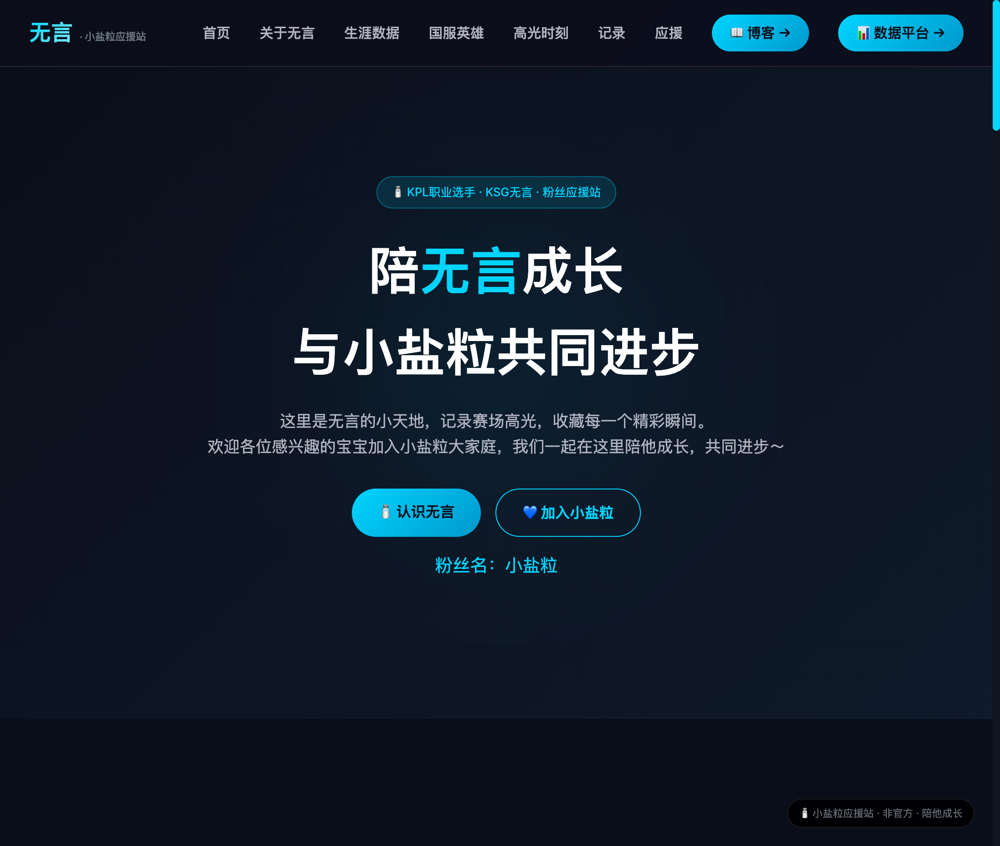

# KPL Stats - 无言粉丝应援站 + 选手数据展示

KPL 选手生涯数据展示平台与粉丝应援站，为电竞选手"KSG.无言"打造的个人数据展示页面与粉丝家园。

## 项目预览

### 粉丝应援站

粉丝应援站包含关于无言的详细信息、生涯高光时刻、国服英雄池等内容。



### 选手个人职业数据平台

数据平台展示无言的职业生涯数据，包括出场次数、击杀、MVP 等关键指标。

更多数据可视化正在开发中...

## 技术栈

| 层级     | 技术          | 版本   |
| -------- | ------------- | ------ |
| **前端** | Vue 3         | 3.4+   |
|          | Vue Router    | 4.x    |
|          | Vite          | 5.0+   |
|          | Axios         | 1.6+   |
| **后端** | FastAPI       | 0.110+ |
|          | Uvicorn       | 0.28+  |
|          | HTTPX         | 0.27+  |
|          | Python-dotenv | 1.0+   |
| **博客** | Halo          | 2.x    |

## 项目结构

```
kpl_stats/
├── backend/                 # 后端服务
│   ├── main.py              # FastAPI 主程序
│   ├── requirements.txt     # Python 依赖
│   ├── .env                 # 环境变量配置
│   ├── .env.example         # 环境变量模板
│   └── data/                # 数据目录（自动生成）
│       ├── cache.all.json       # 全部赛季缓存
│       ├── cache.league.json    # 联赛缓存
│       ├── cache.cup.json       # 杯赛缓存
│       ├── cache.all.YYYY-MM-DD.json    # 全部赛季存档
│       ├── cache.league.YYYY-MM-DD.json # 联赛存档
│       ├── cache.cup.YYYY-MM-DD.json    # 杯赛存档
│       ├── cache.halo.posts.json        # 博客文章缓存
│       └── cache.halo.videos.json       # 视频列表缓存
├── frontend/                # 前端应用（数据平台）
│   ├── index.html
│   ├── package.json
│   ├── vite.config.js
│   ├── .env.development
│   └── src/
│       ├── main.js
│       ├── App.vue          # 主布局组件（导航栏 + router-view）
│       ├── router/
│       │   └── index.js     # 路由配置
│       ├── api/
│       │   └── stats.js     # API 请求封装
│       ├── components/
│       │   ├── Home.vue         # 首页组件
│       │   ├── AdminPanel.vue   # 管理面板组件
│       │   ├── MatchRecords.vue # 比赛记录页面
│       │   └── BackToTop.vue    # 回到顶部组件
│       └── styles/
│           ├── index.css        # 样式入口
│           ├── variables.css    # CSS 变量
│           ├── components.css   # 通用组件样式
│           ├── layouts.css      # 布局样式
│           ├── pages.css        # 页面样式
│           └── admin.css        # 管理面板样式
├── doc/                     # 项目文档
│   ├── halo-api-proxy.md    # Halo API 代理配置指南
│   └── project.md           # 项目详细文档
├── openresty/               # OpenResty 配置
│   └── conf.d/
│       └── kpl-stats.conf   # Nginx 反向代理配置
├── .github/
│   ├── SECRETS.md           # GitHub Secrets 配置说明
│   └── workflows/
│       └── deploy.yml       # GitHub Actions 部署脚本
├── test/                    # 测试数据
├── README.md
└── docker-compose.yml       # Docker Compose 配置
```

> **注意**: 粉丝应援站（homepage）静态页面已迁移至独立仓库 [wuyan-site](https://github.com/scriptsmay/wuyan-site)，由 Vercel 部署。

## 快速开始

### 环境要求

- Python 3.8+（推荐使用 Conda 管理环境）
- Node.js 16+
- npm 或 yarn

### 后端启动

```bash
# 进入后端目录
cd backend

# 激活 Conda 环境（如已配置）
conda activate your-env

# 安装依赖
pip install -r requirements.txt

# 配置环境变量
cp .env.example .env  # 或编辑 .env 文件
# 设置 THIRD_PARTY_API_URL、HALO_API_BASE、HALO_API_TOKEN 等

# 启动开发服务器（推荐）
./dev.sh

# 或直接使用 uvicorn
uvicorn main:app --reload --host 0.0.0.0 --port 8001
```

### 前端启动（数据平台）

```bash
# 进入前端目录
cd frontend

# 安装依赖
npm install

# 启动开发服务器
npm run dev
```

### 粉丝应援站

粉丝应援站静态页面已迁移至独立仓库 [wuyan-site](https://github.com/scriptsmay/wuyan-site)，由 Vercel 部署。

原 kpl_stats 仓库中的 homepage 目录已移除，数据 API 后端保持不变。

### 访问应用

| 应用              | 地址                             | 说明            |
| ----------------- | -------------------------------- | --------------- |
| **数据平台**      | http://localhost:3000            | Vue 前端        |
| **后端 API 文档** | http://localhost:8001/docs       | FastAPI Swagger |
| **数据管理**      | http://localhost:3000/admin      | 管理面板        |
| **比赛记录**      | http://localhost:3000/records    | 比赛记录页面    |

> **粉丝应援站**：已迁移至 [wuyan-site](https://github.com/scriptsmay/wuyan-site) 仓库，由 Vercel 部署（https://kplwuyan.site）。

## 路由配置

前端使用 Vue Router 进行路由管理，当前配置的路由如下：

| 路由      | 组件名称         | 说明           |
| --------- | ---------------- | -------------- |
| `/`       | Home.vue         | 首页           |
| `/admin`  | AdminPanel.vue   | 数据管理面板   |
| `/records`| MatchRecords.vue | 比赛记录页面   |

路由配置文件位于 `frontend/src/router/index.js`。

## API 接口

### 选手数据接口

#### 获取生涯数据

```http
GET /api/player/career?season_type=all&force_refresh=false
```

**参数：**
| 参数 | 类型 | 必填 | 说明 |
|------|------|------|------|
| season_type | string | 否 | 赛季类型：all=全部，league=联赛，cup=杯赛 |
| force_refresh | boolean | 否 | 是否强制刷新缓存 |

**响应示例：**

```json
{
  "code": 200,
  "message": "数据来自缓存",
  "data": { ... },
  "season_type": "all",
  "from_cache": true,
  "cache_time": "2026-03-24T10:30:00"
}
```

#### 手动刷新缓存

```http
POST /api/admin/refresh?season_type=all&force=true
```

#### 查看缓存信息

```http
GET /api/admin/cache_info?season_type=all
```

#### 清除缓存

```http
DELETE /api/admin/cache?season_type=all
```

### Halo 博客接口

#### 获取博客文章列表

```http
GET /api/blog/posts?size=3
```

**响应示例：**

```json
{
  "code": 200,
  "message": "数据来自缓存",
  "data": {
    "items": [
      {
        "title": "文章标题",
        "cover": "https://blog.kplwuyan.site/upload/cover.jpg",
        "excerpt": "文章摘要...",
        "publishTime": "2026-03-23T10:25:00Z",
        "permalink": "/archives/slug"
      }
    ]
  },
  "from_cache": true
}
```

#### 查看博客缓存

```http
GET /api/blog/cache_info
```

#### 清除博客缓存

```http
DELETE /api/blog/cache
```

### Halo 视频接口

#### 随机获取一个视频

```http
GET /api/video/random
```

**响应示例：**

```json
{
  "code": 200,
  "message": "随机视频获取成功",
  "data": {
    "title": "训练日常.mp4",
    "url": "https://blog.kplwuyan.site/upload/video.mp4",
    "poster": "https://blog.kplwuyan.site/upload/video-cover.jpg"
  },
  "meta": {
    "total_videos": 25,
    "cache_used": true
  }
}
```

#### 获取所有视频列表

```http
GET /api/video/list
```

#### 查看视频缓存

```http
GET /api/video/cache_info
```

#### 清除视频缓存

```http
DELETE /api/video/cache
```

### Halo 图库接口

#### 获取照片列表

```http
GET /api/photo/list?force_refresh=false
```

**响应示例：**

```json
{
  "code": 200,
  "message": "照片列表获取成功",
  "data": [
    {
      "title": "赛场瞬间.jpg",
      "url": "https://blog.kplwuyan.site/upload/photo.jpg",
      "thumb_url": "https://blog.kplwuyan.site/upload/photo.jpg?width=400",
      "mediaType": "image/jpeg",
      "size": 1024000,
      "creationTimestamp": "2026-03-28T10:00:00Z"
    }
  ],
  "from_cache": true,
  "cache_time": "2026-03-28T12:00:00"
}
```

#### 查看图库缓存

```http
GET /api/photo/cache_info
```

#### 清除图库缓存

```http
DELETE /api/photo/cache
```

### 其他接口

- `GET /api/health` - 健康检查
- `GET /api/seasons/list` - 获取赛季列表
- `GET /api/seasons/name_map` - 获取赛季名称映射
- `GET /api/admin/cache_list` - 查看所有缓存状态
- `GET /api/admin/archive_list` - 获取历史存档列表
- `GET /api/admin/archive/{date}` - 获取指定日期存档

## 环境变量配置

### 后端 (backend/.env)

```env
# 第三方 API 地址
THIRD_PARTY_API_URL=https://your-api.com/player/career

# API 密钥（如需要）
API_KEY=your_api_key

# 缓存有效期（小时），默认 24 小时
CACHE_TTL_HOURS=24

# Halo 博客 API 配置
HALO_API_BASE=https://blog.kplwuyan.site
HALO_API_TOKEN=your_halo_api_token
HALO_POSTS_CACHE_TTL_HOURS=1

# Halo 视频 API 配置
HALO_VIDEO_GROUP_ID=attachment-group-25ptmssm
HALO_VIDEO_CACHE_TTL_SECONDS=600

# Halo 图库 API 配置
HALO_PHOTO_CACHE_TTL_SECONDS=3600  # 照片列表缓存时间（秒）
```

### 前端 (frontend/.env.development)

```env
# 后端 API 地址
VITE_API_BASE_URL=http://localhost:8001/api
```

### 粉丝应援站 (homepage/config.js)

```javascript
// 开发环境
window.API_BASE_URL = 'http://localhost:8001';

// 生产环境
window.API_BASE_URL = 'https://data.kplwuyan.site/api';
```

## 核心功能

### 数据平台

- ✅ **自动缓存** - 24 小时本地缓存，减少第三方 API 调用
- ✅ **手动刷新** - 支持强制更新数据
- ✅ **降级处理** - API 不可用时返回过期缓存
- ✅ **跨域支持** - Vite 代理，开发环境开箱即用
- ✅ **零数据库** - 文件缓存，无需额外配置
- ✅ **赛季分类** - 支持按赛季类型（全部/联赛/杯赛）筛选
- ✅ **比赛记录** - 展示详细比赛记录列表
- ✅ **回到顶部** - 快速回到页面顶部的便捷功能

### Halo 博客集成

- ✅ **文章列表** - 自动同步 Halo 博客最新文章
- ✅ **封面图处理** - 自动转换相对路径为完整 URL
- ✅ **摘要截断** - 智能处理过长摘要
- ✅ **缓存优化** - 1 小时缓存，减少 API 调用

### Halo 视频集成

- ✅ **随机视频** - 随机返回一个视频附件
- ✅ **封面图生成** - 根据视频 URL 自动生成封面图
- ✅ **列表缓存** - 10 分钟缓存，提高响应速度
- ✅ **降级处理** - API 失败时使用过期缓存

### Halo 图库集成

- ✅ **照片墙** - 展示 Halo 图库中的照片
- ✅ **懒加载** - 图片使用 lazyload 优化加载性能
- ✅ **缩略图** - 自动使用 `?width=400` 参数获取小尺寸缩略图
- ✅ **灯箱效果** - 点击照片以灯箱形式查看原图
- ✅ **缓存优化** - 1 小时缓存，减少 API 调用

## 部署

### GitHub Actions 自动部署

项目已配置 CI/CD 流程，推送到 `main` 分支时自动部署到服务器。

**必需的 GitHub Secrets：**

```bash
# 服务器配置
SSH_PRIVATE_KEY=...
SERVER_HOST=...
SERVER_USER=...
DEPLOY_PATH=/root/docker/kpl_stats
FRONTEND_TARGET=/opt/1panel/www/sites/data.kplwuyan.site/index

# 后端环境变量
THIRD_PARTY_API_URL=...
HALO_API_BASE=https://blog.kplwuyan.site
HALO_API_TOKEN=...
HALO_VIDEO_GROUP_ID=...
```

详见：[`.github/SECRETS.md`](.github/SECRETS.md)

### 手动部署

**后端：**

```bash
pip install gunicorn
gunicorn -w 4 -k uvicorn.workers.UvicornWorker main:app
```

**前端（数据平台）：**

```bash
npm run build
# 将 dist 目录部署到 Nginx 或其他静态服务器
```

**粉丝应援站：**

```bash
# 构建（如需要）
# 将 homepage/ 目录部署到静态服务器
```

## 文档

| 文档                                               | 说明                    |
| -------------------------------------------------- | ----------------------- |
| [`doc/halo-api-proxy.md`](doc/halo-api-proxy.md)   | Halo API 代理配置指南   |
| [`.github/SECRETS.md`](.github/SECRETS.md)         | GitHub Secrets 配置说明 |

## 常见问题

### Q: 跨域问题怎么解决？

前端开发环境已配置 Vite 代理，生产环境需配置 Nginx 反向代理。

### Q: 数据更新不及时怎么办？

调用 `POST /api/admin/refresh?force=true` 手动刷新缓存。

### Q: Halo API 返回 401 错误？

1. 确认 `HALO_API_TOKEN` 配置正确
2. 在 Halo 后台重新生成 Token 并更新配置

### Q: 如何修改缓存时间？

- 选手数据：修改 `CACHE_TTL_HOURS`
- 博客文章：修改 `HALO_POSTS_CACHE_TTL_HOURS`
- 视频列表：修改 `HALO_VIDEO_CACHE_TTL_SECONDS`

## 开发说明

### 代码风格

- **Python**: PEP 8 规范
- **Vue**: 组合式 API + `<script setup>` 语法
- **CSS**: Scoped 样式

### 常用命令

```bash
# 后端
cd backend
./dev.sh                    # 启动开发服务器（推荐）
uvicorn main:app --reload   # 或直接使用 uvicorn

# 前端（数据平台）
cd frontend
npm run dev      # 开发模式
npm run build    # 构建生产版本
npm run preview  # 预览构建结果

# 粉丝应援站
cd homepage
# 使用任意静态文件服务器
python -m http.server 3000
```

## 许可证

MIT License

---

**项目维护者**: scriptsmay
**特别感谢**: qwen code 帮助我完成了整个项目

**文档版本**: 2.2
**更新日期**: 2026-03-28
